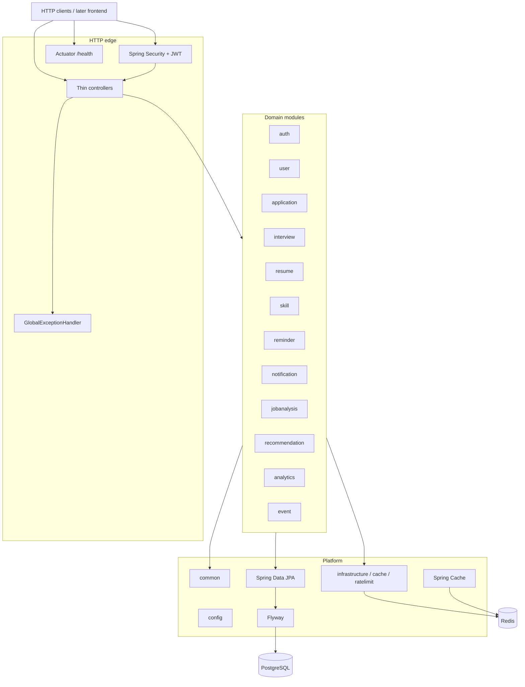

# JobPilot

Backend-first intelligent job application tracker. This repository is the primary portfolio deliverable: a **modular monolith** on Spring Boot. A frontend will come much later.

**Current scope: Phase 1 foundation + Phase 2 JWT authentication + Phase 3 application tracking + Phase 4 interview management + Phase 5 resumes and skills + Phase 6 job description analysis / match + Phase 7 recommendation engine + Phase 8 reminders / scheduler / in-app notifications + Phase 9 transactional outbox / Kafka + Phase 10 Redis caching / API rate limiting.** Email delivery retries, analytics, and a UI remain out of scope.

## Architecture

JobPilot is organized as a single deployable Spring Boot application with package-level module boundaries. Later phases add behavior inside these packages; they do not introduce a microservice split.



Package root: `com.jobpilot`. Controllers stay thin; business logic lives in services. JPA entities are not exposed in API responses — use DTOs.

## Tech stack

| Piece | Choice |
| --- | --- |
| Language | Java 21 |
| Framework | Spring Boot 3.5 |
| Build | Gradle (Kotlin DSL) |
| Persistence | Spring Data JPA + Flyway |
| Database | PostgreSQL 16 (H2 for tests) |
| Security | Spring Security + JWT (jjwt) + BCrypt |
| Messaging | Spring Kafka + transactional outbox |
| Cache / rate limit | Spring Cache + Redis (in-memory fallback when Redis is disabled) |
| Ops | Spring Boot Actuator (`/actuator/health`) |
| Packaging | Dockerfile + Docker Compose |

Hibernate `ddl-auto` is **`none`** on the main profile. Schema changes go through Flyway (`V1__init.sql` … `V7__reminders_and_notifications.sql`, `V8__outbox_events.sql`). Phase 10 adds no Flyway migration — cache and rate-limit state live in Redis (or process memory).

## Prerequisites

- JDK 21
- Docker (for PostgreSQL, Kafka, Redis, and optionally the app image)

## Environment variables

Copy [`.env.example`](.env.example) to `.env` and adjust. Nothing secret is committed.

| Variable | Purpose | Default |
| --- | --- | --- |
| `SERVER_PORT` | HTTP port | `8080` |
| `SPRING_PROFILES_ACTIVE` | Spring profile | `local` (compose / example) |
| `SPRING_DATASOURCE_URL` | JDBC URL | `jdbc:postgresql://localhost:5432/jobpilot` |
| `SPRING_DATASOURCE_USERNAME` | DB user | `jobpilot` |
| `SPRING_DATASOURCE_PASSWORD` | DB password | `changeme` |
| `POSTGRES_DB` / `POSTGRES_USER` / `POSTGRES_PASSWORD` / `POSTGRES_PORT` | Compose Postgres service | `jobpilot` / `jobpilot` / `changeme` / `5432` |
| `JOBPILOT_JWT_SECRET` | HMAC secret for access tokens | **local/test default only — override in production** |
| `JOBPILOT_JWT_EXPIRATION_MS` | Access token lifetime (ms) | `86400000` (24h) |
| `SPRING_DATA_REDIS_HOST` / `SPRING_DATA_REDIS_PORT` / `SPRING_DATA_REDIS_PASSWORD` | Redis connection | `localhost` / `6379` / empty |
| `JOBPILOT_REDIS_ENABLED` | Use Redis for cache + rate-limit counters | `true` (tests: `false`) |
| `JOBPILOT_CACHE_RECOMMENDATIONS_TTL` | `recommendations` cache TTL | `120s` |
| `JOBPILOT_CACHE_APPLICATION_MATCH_TTL` | `applicationMatch` cache TTL | `180s` |
| `JOBPILOT_RATE_LIMIT_ENABLED` | Enable the API rate-limit filter | `true` |
| `JOBPILOT_RATE_LIMIT_DEFAULT` | Global API requests per identity per window | `100` |
| `JOBPILOT_RATE_LIMIT_AUTH` | `/api/auth/**` requests per IP per window | `10` |
| `JOBPILOT_RATE_LIMIT_WINDOW` | Fixed window | `1m` |

> **Production:** you **must** set `JOBPILOT_JWT_SECRET` to a long random value (e.g. `openssl rand -base64 48`). The YAML default is for local development and tests only.

## Local run

### 1. PostgreSQL via Docker Compose

```bash
docker compose up -d postgres kafka redis
```

Postgres is enough for a DB-only boot. Add Kafka (Phase 9 outbox relay/consumer) and Redis (Phase 10 cache + rate limits) for the full local stack.

This publishes Postgres on `localhost:5432` with the defaults above.

### 2. Application via Gradle

```bash
./gradlew bootRun
```

Or with the local profile (more verbose SQL logging):

```bash
./gradlew bootRun --args='--spring.profiles.active=local'
```

Useful URLs:

- `GET /api/v1/ping` — trivial ping (public)
- `GET /actuator/health` — Actuator health (public)
- `POST /api/auth/register` / `POST /api/auth/login` — auth (public)
- `GET /api/users/me` — current user (requires `Authorization: Bearer <token>`)
- `/api/applications` — application CRUD (requires Bearer JWT)
- `/api/applications/{applicationId}/interviews` and `/api/interviews/{id}` — interview management (requires Bearer JWT)
- `/api/resumes` — resume library (requires Bearer JWT)
- `/api/skills` — user skill profile (requires Bearer JWT)
- `/api/recommendations` — next-action recommendations (requires Bearer JWT)
- `/api/reminders` — reminder CRUD (requires Bearer JWT)
- `/api/notifications` — in-app notifications (requires Bearer JWT)
- Errors use a fixed JSON shape: `timestamp`, `status`, `error`, `message`, `path`

### 3. Optional: app container as well

```bash
docker compose --profile app up --build
```

The app container talks to the `postgres` service on the compose network. Pass `JOBPILOT_JWT_SECRET` via the environment when using this path.

## Phase 2 — JWT authentication

### Endpoints

| Method | Path | Auth | Notes |
| --- | --- | --- | --- |
| `POST` | `/api/auth/register` | Public | Body: `email`, `password` (min 8), optional `name`. Returns JWT + user. Duplicate email → **409**. |
| `POST` | `/api/auth/login` | Public | Body: `email`, `password`. Returns JWT + user. Bad credentials → **401**. |
| `GET` | `/api/users/me` | Bearer JWT | Current user from `SecurityContext` (never trust a client-supplied user id). Missing/invalid token → **401**. |

Passwords are stored as BCrypt hashes. Access tokens are HS256 JWTs (jjwt). Refresh tokens are out of scope for v1.

### curl examples

```bash
# Register
curl -sS -X POST http://localhost:8080/api/auth/register \
  -H 'Content-Type: application/json' \
  -d '{"email":"you@example.com","password":"password123","name":"You"}'

# Login
TOKEN=$(curl -sS -X POST http://localhost:8080/api/auth/login \
  -H 'Content-Type: application/json' \
  -d '{"email":"you@example.com","password":"password123"}' \
  | python3 -c "import sys,json; print(json.load(sys.stdin)['accessToken'])")

# Current user
curl -sS http://localhost:8080/api/users/me \
  -H "Authorization: Bearer $TOKEN"
```


## Phase 3 — Application tracking

Authenticated CRUD for job applications with DB-level filtering, status state machine, status history, and optimistic locking.

### Domain

| Field | Notes |
| --- | --- |
| `id`, `userId` | UUID; `userId` always from `SecurityContext` (never from the client body) |
| `company`, `jobTitle` | Required |
| `jobUrl`, `location`, `employmentType`, `source` | Optional |
| `status` | `SAVED`, `APPLIED`, `OA`, `INTERVIEW`, `OFFER`, `REJECTED`, `WITHDRAWN` |
| `source` | `LINKEDIN`, `COMPANY_WEBSITE`, `REFERRAL`, `RECRUITER`, `JOB_PORTAL`, `OTHER` |
| `employmentType` | `FULL_TIME`, `PART_TIME`, `CONTRACT`, `INTERNSHIP`, `TEMPORARY`, `OTHER` |
| `salaryMin`, `salaryMax` | Optional integers |
| `jobDescription`, `notes` | Optional text |
| `appliedAt`, `createdAt`, `updatedAt` | Timestamps |
| `version` | `@Version` optimistic lock — required on `PATCH` |

Status transitions are validated by `ApplicationStatusTransitionValidator`. Every status change (including create) writes a row to `application_status_history`.

### Endpoints

| Method | Path | Auth | Notes |
| --- | --- | --- | --- |
| `POST` | `/api/applications` | Bearer JWT | Create. Default status `SAVED`. |
| `GET` | `/api/applications` | Bearer JWT | Paginated list. Filters: `status`, `q` (company/title/location/notes). Sort e.g. `sort=appliedAt,desc`. |
| `GET` | `/api/applications/{id}` | Bearer JWT | Owner only; missing/other user → **404**. |
| `PATCH` | `/api/applications/{id}` | Bearer JWT | Partial update; body must include `version`. Stale version → **409**. Invalid transition → **400**. |
| `DELETE` | `/api/applications/{id}` | Bearer JWT | Owner only. |

### curl examples

```bash
# Register / login (reuse TOKEN from Phase 2)
TOKEN=$(curl -sS -X POST http://localhost:8080/api/auth/login \
  -H 'Content-Type: application/json' \
  -d '{"email":"you@example.com","password":"password123"}' \
  | python3 -c "import sys,json; print(json.load(sys.stdin)['accessToken'])")

# Create application
curl -sS -X POST http://localhost:8080/api/applications \
  -H "Authorization: Bearer $TOKEN" \
  -H 'Content-Type: application/json' \
  -d '{
    "company":"Google",
    "jobTitle":"Software Engineer",
    "jobUrl":"https://careers.google.com/jobs/1",
    "location":"Mountain View",
    "employmentType":"FULL_TIME",
    "source":"LINKEDIN",
    "status":"SAVED",
    "salaryMin":150000,
    "salaryMax":200000,
    "notes":"Dream role"
  }'

# List / filter / search
curl -sS "http://localhost:8080/api/applications?status=INTERVIEW&page=0&size=20&q=google&sort=appliedAt,desc" \
  -H "Authorization: Bearer $TOKEN"

# Get one
curl -sS http://localhost:8080/api/applications/<id> \
  -H "Authorization: Bearer $TOKEN"

# Patch (include version from GET/create response)
curl -sS -X PATCH http://localhost:8080/api/applications/<id> \
  -H "Authorization: Bearer $TOKEN" \
  -H 'Content-Type: application/json' \
  -d '{"version":0,"status":"APPLIED","notes":"Submitted"}'

# Delete
curl -sS -X DELETE http://localhost:8080/api/applications/<id> \
  -H "Authorization: Bearer $TOKEN"
```

## Phase 4 — Interview management

Authenticated interview-round CRUD is isolated through the owning application. The API never accepts a user id: both parent and interview lookups use the authenticated principal, and resources belonging to another user return **404**.

Each interview has a positive `roundNumber` that is unique within its application, a `type` (`OA`, `TECHNICAL`, `SYSTEM_DESIGN`, `MANAGERIAL`, `HR`, `OTHER`), a `status` (`SCHEDULED`, `COMPLETED`, `CANCELLED`, `NO_SHOW`), scheduling details, optional notes/feedback, timestamps, and an optimistic-lock `version`. Status transitions are `SCHEDULED` → `COMPLETED`, `CANCELLED`, or `NO_SHOW`; terminal statuses cannot transition. Creating an interview intentionally **does not change the parent application status** in Phase 4.

### Endpoints

| Method | Path | Notes |
| --- | --- | --- |
| `POST` | `/api/applications/{applicationId}/interviews` | Create a round. Status defaults to `SCHEDULED`. Duplicate round → **409**. |
| `GET` | `/api/applications/{applicationId}/interviews` | Paginated; defaults to `roundNumber,scheduledAt` ascending. |
| `GET` | `/api/interviews/{id}` | Get an owned interview. |
| `PATCH` | `/api/interviews/{id}` | Partial update; optional `version` detects stale writes. Invalid transition → **400**. |
| `DELETE` | `/api/interviews/{id}` | Delete an owned interview. |

### curl examples

```bash
# Create (reuse TOKEN and an application id from earlier examples)
curl -sS -X POST http://localhost:8080/api/applications/<applicationId>/interviews \
  -H "Authorization: Bearer $TOKEN" \
  -H 'Content-Type: application/json' \
  -d '{
    "roundNumber":1,
    "type":"TECHNICAL",
    "scheduledAt":"2026-10-10T15:00:00Z",
    "interviewer":"Ada Lovelace",
    "meetingLink":"https://meet.example/round-1"
  }'

# List in round/schedule order
curl -sS 'http://localhost:8080/api/applications/<applicationId>/interviews?page=0&size=20' \
  -H "Authorization: Bearer $TOKEN"

# Get one
curl -sS http://localhost:8080/api/interviews/<id> \
  -H "Authorization: Bearer $TOKEN"

# Complete with optional feedback (version is from create/get)
curl -sS -X PATCH http://localhost:8080/api/interviews/<id> \
  -H "Authorization: Bearer $TOKEN" \
  -H 'Content-Type: application/json' \
  -d '{"version":0,"status":"COMPLETED","feedback":"Strong technical performance"}'

# Delete
curl -sS -X DELETE http://localhost:8080/api/interviews/<id> \
  -H "Authorization: Bearer $TOKEN"
```

## Phase 5 — Resumes and skills

Authenticated resume library and skill profile, isolated to the current user. The API never accepts a user id: lookups use the authenticated principal, and resources belonging to another user return **404**.

### Resumes

| Field | Notes |
| --- | --- |
| `id`, `userId` | UUID; `userId` always from `SecurityContext` |
| `name` | Required |
| `versionLabel` | Optional string label (e.g. `V2`) — this is the resume version, not an optimistic-lock field |
| `description`, `fileUrl` | Optional (`fileUrl` max 2048) |
| `createdAt`, `updatedAt` | Timestamps |

| Method | Path | Notes |
| --- | --- | --- |
| `POST` | `/api/resumes` | Create. |
| `GET` | `/api/resumes` | List current user's resumes (newest `updatedAt` first). |
| `GET` | `/api/resumes/{id}` | Owner only. |
| `PATCH` | `/api/resumes/{id}` | Partial update; null fields are left unchanged. |
| `DELETE` | `/api/resumes/{id}` | Owner only. **ON DELETE SET NULL**: applications that referenced this resume keep their row and `resumeId` becomes `null`. |

### Skills

Skill names are **normalized** (trim + lowercase) and unique per user via `UNIQUE (user_id, name)`.

| Method | Path | Notes |
| --- | --- | --- |
| `GET` | `/api/skills` | List current user's skills (name ascending). |
| `POST` | `/api/skills` | Create. Duplicate (case-insensitive) → **409**. |
| `DELETE` | `/api/skills/{id}` | Owner only; missing/other user → **404**. |

### Application ↔ resume

`CreateApplicationRequest` / `UpdateApplicationRequest` / `ApplicationResponse` include optional `resumeId`.

- On create/update, a non-null `resumeId` must belong to the same user; otherwise **404** (`Resume not found`).
- On `PATCH`, omit `resumeId` to leave it unchanged; send `"resumeId": null` to unlink without deleting the resume.
- Deleting a resume does **not** delete applications; the FK is `ON DELETE SET NULL`.

### curl examples

```bash
# Reuse TOKEN from Phase 2
TOKEN=$(curl -sS -X POST http://localhost:8080/api/auth/login \
  -H 'Content-Type: application/json' \
  -d '{"email":"you@example.com","password":"password123"}' \
  | python3 -c "import sys,json; print(json.load(sys.stdin)['accessToken'])")

# Create a resume
curl -sS -X POST http://localhost:8080/api/resumes \
  -H "Authorization: Bearer $TOKEN" \
  -H 'Content-Type: application/json' \
  -d '{
    "name":"Backend SWE",
    "versionLabel":"V2",
    "description":"Tailored for backend roles",
    "fileUrl":"https://files.example/resume-v2.pdf"
  }'

# List / get / patch / delete
curl -sS http://localhost:8080/api/resumes -H "Authorization: Bearer $TOKEN"
curl -sS http://localhost:8080/api/resumes/<id> -H "Authorization: Bearer $TOKEN"
curl -sS -X PATCH http://localhost:8080/api/resumes/<id> \
  -H "Authorization: Bearer $TOKEN" \
  -H 'Content-Type: application/json' \
  -d '{"versionLabel":"V3","description":"Added recent role"}'
curl -sS -X DELETE http://localhost:8080/api/resumes/<id> -H "Authorization: Bearer $TOKEN"

# Skills
curl -sS -X POST http://localhost:8080/api/skills \
  -H "Authorization: Bearer $TOKEN" \
  -H 'Content-Type: application/json' \
  -d '{"name":"Java"}'
curl -sS http://localhost:8080/api/skills -H "Authorization: Bearer $TOKEN"
curl -sS -X DELETE http://localhost:8080/api/skills/<id> -H "Authorization: Bearer $TOKEN"

# Attach a resume when creating / updating an application
curl -sS -X POST http://localhost:8080/api/applications \
  -H "Authorization: Bearer $TOKEN" \
  -H 'Content-Type: application/json' \
  -d '{"company":"Google","jobTitle":"Software Engineer","resumeId":"<resumeId>"}'

curl -sS -X PATCH http://localhost:8080/api/applications/<applicationId> \
  -H "Authorization: Bearer $TOKEN" \
  -H 'Content-Type: application/json' \
  -d '{"version":0,"resumeId":"<resumeId>"}'
```

## Phase 6 — Job description analyzer + match engine

Deterministic, **no-LLM** skill extraction from free-text job descriptions, plus an explainable overlap score against the current user's skills. Useful for demos and as a stable baseline before any future ML/LLM analyzer.

### Analyzer

`JobDescriptionAnalyzer` abstracts extraction. The Phase 6 implementation is `RuleBasedJobDescriptionAnalyzer`: case-insensitive keyword/alias matching against a curated `SkillDictionary` (Java, Spring Boot, Kafka, PostgreSQL/postgres, Redis, Docker, AWS, Kubernetes/k8s, System Design, and more). Aliases map to **canonical lowercase** skill names (aligned with Phase 5 skill normalization). Word-boundary matching avoids false positives such as `java` inside `javascript`.

Optional persistence: table `job_requirements` (`application_id`, `skill_name`, `created_at`) via Flyway `V6__job_analysis.sql`. Re-analyze **replaces** rows for that application.

### Match score formula

Compare extracted/stored required skills vs the current user's skills from `SkillRepository`:

- If `requiredSkills` is empty → `score = 100` and `matchedSkills` / `missingSkills` / `requiredSkills` are all empty lists.
- Otherwise:

```text
score = round(100.0 * matchedSkills.size() / max(requiredSkills.size(), 1))
```

This is **coverage of required skills**, not a hiring probability.

Example response:

```json
{
  "score": 71,
  "matchedSkills": ["docker", "java", "kafka", "kubernetes", "redis"],
  "missingSkills": ["postgresql", "spring boot"],
  "requiredSkills": ["docker", "java", "kafka", "kubernetes", "postgresql", "redis", "spring boot"]
}
```

### APIs (authenticated, user-isolated)

Ownership is always taken from `SecurityContext`. Another user's application → **404**.

| Method | Path | Notes |
| --- | --- | --- |
| `POST` | `/api/applications/{applicationId}/analyze` | Uses `application.jobDescription`; **400** if blank. Stores/replaces `job_requirements`. Returns match payload (includes `requiredSkills`). |
| `GET` | `/api/applications/{applicationId}/match` | Recomputes match from stored requirements; if none, re-analyzes (and persists) when JD is present. |
| `POST` | `/api/job-analysis/preview` | Body `{ "jobDescription": "..." }`. Analyze + match **without** persisting. |

### curl examples

```bash
# Reuse TOKEN from Phase 2
TOKEN=$(curl -sS -X POST http://localhost:8080/api/auth/login \
  -H 'Content-Type: application/json' \
  -d '{"email":"you@example.com","password":"password123"}' \
  | python3 -c "import sys,json; print(json.load(sys.stdin)['accessToken'])")

# Seed skills (Phase 5)
curl -sS -X POST http://localhost:8080/api/skills \
  -H "Authorization: Bearer $TOKEN" -H 'Content-Type: application/json' \
  -d '{"name":"Java"}'
curl -sS -X POST http://localhost:8080/api/skills \
  -H "Authorization: Bearer $TOKEN" -H 'Content-Type: application/json' \
  -d '{"name":"Kafka"}'

# Create application with a job description
APP=$(curl -sS -X POST http://localhost:8080/api/applications \
  -H "Authorization: Bearer $TOKEN" -H 'Content-Type: application/json' \
  -d '{
    "company":"Example Corp",
    "jobTitle":"Backend Engineer",
    "jobDescription":"Java, Spring Boot, Kafka, Postgres, Redis, Docker, K8s, AWS. System Design a plus."
  }')
APP_ID=$(python3 -c "import sys,json; print(json.load(sys.stdin)['id'])" <<<"$APP")

# Analyze (persist requirements + match)
curl -sS -X POST http://localhost:8080/api/applications/$APP_ID/analyze \
  -H "Authorization: Bearer $TOKEN"

# Match from stored requirements (recomputes against current skills)
curl -sS http://localhost:8080/api/applications/$APP_ID/match \
  -H "Authorization: Bearer $TOKEN"

# Preview without persisting
curl -sS -X POST http://localhost:8080/api/job-analysis/preview \
  -H "Authorization: Bearer $TOKEN" -H 'Content-Type: application/json' \
  -d '{"jobDescription":"Looking for Python, Redis, and Kubernetes experience."}'
```


## Phase 7 — Recommendation engine

Deterministic, **rule-based** next-action suggestions (no ML/LLM). Recommendations are **computed on read** from application status, timestamps, interviews, and optional Phase 6 match scores — no new Flyway table.

### Rules

| Condition | Action | Priority |
| --- | --- | --- |
| Status `APPLIED` or `OA`, no update for ≥7 days | `FOLLOW_UP` | HIGH |
| Status `INTERVIEW`, `SCHEDULED` interview within next 2 days | `PREPARE_FOR_INTERVIEW` | HIGH |
| Status `INTERVIEW`, recent `COMPLETED` interview, ≥3 days since completion, no upcoming scheduled interview | `INTERVIEW_FOLLOW_UP` | MEDIUM |
| Status `REJECTED` | `REVIEW_FEEDBACK` | MEDIUM if rejected ≤14 days ago, else LOW |
| Status `SAVED`, idle ≥14 days | `APPLY_OR_ARCHIVE` | MEDIUM |
| Status `OFFER` | `EVALUATE_OFFER` | HIGH |
| Stored job analysis exists and match score &lt; 50 (skipped for OFFER/REJECTED/WITHDRAWN) | `IMPROVE_SKILLS` | LOW |

When multiple rules fire for one application, the engine picks the **best** by priority (HIGH → LOW) then urgency (e.g. longer stale / sooner interview). The list endpoint returns at most one recommendation per active application (excludes `WITHDRAWN`), sorted the same way.

### Response shape

```json
{
  "action": "FOLLOW_UP",
  "priority": "HIGH",
  "title": "Follow up with recruiter",
  "reason": "No application update for 8 days",
  "applicationId": "..."
}
```

### APIs (authenticated, user-isolated)

| Method | Path | Notes |
| --- | --- | --- |
| `GET` | `/api/applications/{id}/recommendation` | Best next action for one owned application. Other user / missing → **404**. No rule matches → **404** (`No recommendation available for this application`). |
| `GET` | `/api/recommendations` | Recommendations across the current user's active applications. Optional `limit` (default **10**, max 100). Sorted by priority then urgency. |

### curl examples

```bash
# Reuse TOKEN from Phase 2
TOKEN=$(curl -sS -X POST http://localhost:8080/api/auth/login \
  -H 'Content-Type: application/json' \
  -d '{"email":"you@example.com","password":"password123"}' \
  | python3 -c "import sys,json; print(json.load(sys.stdin)['accessToken'])")

# Best next action for one application
curl -sS http://localhost:8080/api/applications/<applicationId>/recommendation \
  -H "Authorization: Bearer $TOKEN"

# Top recommendations across active applications
curl -sS "http://localhost:8080/api/recommendations?limit=5" \
  -H "Authorization: Bearer $TOKEN"
```

## Phase 8 — Reminders, scheduler, in-app notifications

User-owned reminders with a Spring `@Scheduled` job that fires due items and creates **in-app** notifications. Email delivery is stubbed for Phase 9.

### Reminder model

| Field | Notes |
| --- | --- |
| `type` | `FOLLOW_UP`, `INTERVIEW_PREPARATION`, `INTERVIEW_FOLLOW_UP`, `OFFER_EXPIRY`, `CUSTOM` |
| `status` | `PENDING`, `PROCESSED`, `CANCELLED` |
| `applicationId` | Required for non-`CUSTOM` types; must belong to the current user. Nullable for `CUSTOM`. |
| `scheduledAt` / `completedAt` | When due / when processed or cancelled |

Auto-create of `INTERVIEW_PREPARATION` when an interview is scheduled is **manual-only in Phase 8** (avoid coupling / Phase 4 test churn). Create reminders via `POST /api/reminders`.

### Notification model

| Field | Notes |
| --- | --- |
| `type` | `REMINDER`, `SYSTEM` |
| `status` | `PENDING` → `SENT` (in-app) → `READ`; `FAILED` reserved for later channels |
| `reminderId` | Set when created from a reminder; **UNIQUE** so a reminder cannot produce two rows |
| `retryCount` / `sentAt` | Ready for Phase 9 email retries |

`InAppNotificationProvider` marks notifications `SENT` immediately. `EmailNotificationProvider` is a no-op stub.

### Scheduler + idempotency

- `@EnableScheduling` on the reminder module; job every **60s** (configurable via `jobpilot.reminders.scheduler.fixed-delay-ms`).
- Disable with `jobpilot.reminders.scheduler.enabled=false` (tests do this and call `ReminderProcessor` directly).
- Each tick: find `PENDING` rows with `scheduledAt <= now`, then **claim** with:

```sql
UPDATE reminders
SET status = 'PROCESSED', completed_at = :now
WHERE id = :id AND status = 'PENDING'
```

Only when the update count is **1** does the processor create a notification. A second tick (or concurrent worker) sees `0` and skips — **no duplicate notifications**. Unique `notifications.reminder_id` is a second guard.

### APIs (authenticated, user-isolated)

| Method | Path | Notes |
| --- | --- | --- |
| `POST` | `/api/reminders` | Create (`PENDING`). |
| `GET` | `/api/reminders` | Pageable list; optional `status`. |
| `GET` | `/api/reminders/{id}` | Owner only; other user → **404**. |
| `PATCH` | `/api/reminders/{id}` | Reschedule / edit title/description while `PENDING`; or `{"status":"CANCELLED"}`. |
| `DELETE` | `/api/reminders/{id}` | Hard delete. |
| `GET` | `/api/notifications` | Pageable list for current user. |
| `PATCH` | `/api/notifications/{id}/read` | Mark `READ`. |

### curl examples

```bash
TOKEN=$(curl -sS -X POST http://localhost:8080/api/auth/login \
  -H 'Content-Type: application/json' \
  -d '{"email":"you@example.com","password":"password123"}' \
  | python3 -c "import sys,json; print(json.load(sys.stdin)['accessToken'])")

# Create a follow-up reminder (applicationId from Phase 3)
curl -sS -X POST http://localhost:8080/api/reminders \
  -H "Authorization: Bearer $TOKEN" -H 'Content-Type: application/json' \
  -d '{
    "applicationId":"<applicationId>",
    "type":"FOLLOW_UP",
    "title":"Follow up with recruiter",
    "description":"Send a polite check-in email",
    "scheduledAt":"2026-09-14T15:00:00Z"
  }'

# List pending
curl -sS "http://localhost:8080/api/reminders?status=PENDING" \
  -H "Authorization: Bearer $TOKEN"

# Cancel
curl -sS -X PATCH http://localhost:8080/api/reminders/<reminderId> \
  -H "Authorization: Bearer $TOKEN" -H 'Content-Type: application/json' \
  -d '{"status":"CANCELLED"}'

# After the scheduler processes a due reminder:
curl -sS http://localhost:8080/api/notifications \
  -H "Authorization: Bearer $TOKEN"

curl -sS -X PATCH http://localhost:8080/api/notifications/<notificationId>/read \
  -H "Authorization: Bearer $TOKEN"
```

## Phase 9 — Transactional outbox + Kafka

Reliable domain-event publishing via the **transactional outbox** pattern. Domain services write a PENDING row to `outbox_events` in the **same database transaction** as the business change; a scheduled relay publishes those rows to Kafka afterward.

### Why outbox

Direct `KafkaTemplate.send` inside a domain transaction can lose events (DB commits, broker send fails) or publish phantom events (send succeeds, DB rolls back). The outbox makes the write durable with the domain change, then relays asynchronously.

### Delivery semantics

**At-least-once.** The relay sends to Kafka first, then marks the row `PUBLISHED`. A crash between those steps can republish the same payload. Consumers must be idempotent (see listener stub). After `jobpilot.outbox.relay.max-attempts` failed sends, the row becomes `FAILED`.

Email delivery retries are intentionally **not** part of Phase 9 — this phase is the messaging backbone only.

### Local Kafka

```bash
docker compose up -d postgres kafka redis
# Kafka (Bitnami, KRaft, no ZooKeeper) on localhost:9092
# Redis 7 on localhost:6379 (Phase 10)
```

Env vars (see `.env.example`): `SPRING_KAFKA_BOOTSTRAP_SERVERS`, `JOBPILOT_OUTBOX_*`, `JOBPILOT_KAFKA_CONSUMER_*`.

### What gets emitted

When an application is created (initial status) or its status transitions via PATCH, `ApplicationService` calls `OutboxPublisher` with `ApplicationStatusChangedEvent` (`applicationId`, `userId`, `fromStatus`, `toStatus`, `occurredAt`). Topic default: `jobpilot.application.events` (partition key = application id).

No public REST API for the outbox — it is an internal reliability mechanism.

### Consumer skeleton

`ApplicationStatusChangedListener` deserializes and logs events. Enable with `jobpilot.kafka.consumer.enabled=true`. Structure leaves room for a future processed-events table; duplicates are expected under at-least-once delivery.

### Tests without Kafka

`./gradlew test` does **not** require a broker:

- `jobpilot.outbox.relay.enabled=false` and `jobpilot.kafka.consumer.enabled=false` in `application-test.yml`
- Unit tests mock `KafkaTemplate`
- Integration tests assert PENDING outbox rows after application create/status change

## Phase 10 — Redis caching + API rate limiting

Read-through caches for high-read, low-staleness endpoints, plus a servlet filter that rate-limits by user (authenticated) or IP (login/register). Redis is the production store; tests and local-without-Redis use in-memory stand-ins. **No new Flyway migration.**

### Local Redis

```bash
docker compose up -d postgres kafka redis
# Redis 7 (alpine) on localhost:6379
```

Set `JOBPILOT_REDIS_ENABLED=false` to skip Redis entirely: Spring Cache uses `ConcurrentMapCacheManager`, and rate limiting uses a process-local concurrent map. TTL is not applied in that mode (entries live until eviction or process exit).

### Cache names and eviction

| Cache | Key | Default TTL (Redis) | What |
| --- | --- | --- | --- |
| `recommendations` | `userId:limit` (limit normalized, default 10, max 100) | 120s | `GET /api/recommendations` |
| `applicationMatch` | `userId:applicationId` | 180s | `GET /api/applications/{id}/match` |

Domain services use only `@Cacheable` / `CacheEviction` — no Redis types leak into `application`, `recommendation`, `skill`, or `jobanalysis`.

Eviction (same behavior with in-memory or Redis):

- Application create / update / delete → user's `recommendations`
- Application delete, or `jobDescription` change → that `applicationMatch`
- Skill add / delete → user's `recommendations` and all of their `applicationMatch` entries
- Analyze (and first-time persist on match GET) → that `applicationMatch` + user `recommendations`
- Interview create / update / delete → user's `recommendations`

When Redis prefix-scan is unavailable, eviction of "all keys for a user" falls back to clearing that cache name. TTLs are short, so that is acceptable.

### Rate limiting

`RateLimitFilter` runs **after** JWT so `SecurityContext` is populated.

| Traffic | Identity | Default limit |
| --- | --- | --- |
| Authenticated API | user id | 100 req / min |
| `/api/auth/**` (login / register) | client IP | 10 req / min |
| Other anonymous | client IP | 100 req / min |

IP resolution: first `X-Forwarded-For` hop, else `X-Real-IP`, else `remoteAddr`.

**Excluded:** `GET /actuator/health` (+ `/actuator/health/**`) and `GET /api/v1/ping`.

On exceed: **HTTP 429** with the standard error JSON (`timestamp`, `status`, `error`, `message`, `path`) and a `Retry-After` header (seconds remaining in the window). Counters are a **fixed window**. Redis uses atomic `INCR` + `PEXPIRE`; when Redis is disabled the same window math runs in a `ConcurrentHashMap`.

### Tests without Redis (or Kafka)

`./gradlew test` does **not** require a Redis or Kafka broker:

- `jobpilot.redis.enabled=false` in `application-test.yml` — in-memory `CacheManager` + in-memory rate-limit store; Redis auto-configuration is excluded
- Rate-limit defaults in tests are raised to 10000/min so existing flows do not trip 429
- Dedicated tests set low limits via `@TestPropertySource` and assert 429 in in-memory mode

## Tests and build

Tests use an in-memory H2 database (PostgreSQL compatibility mode) and in-memory cache/rate-limit stores, so they do not require Docker.

```bash
./gradlew test
./gradlew build
```

## Planned later phases (not implemented)

Phases 11–13 are planned and **not** present here. Expected later work includes email delivery with retries, analytics, and a frontend. Do not treat remaining placeholder packages as working features.

## License

No license has been chosen yet.
