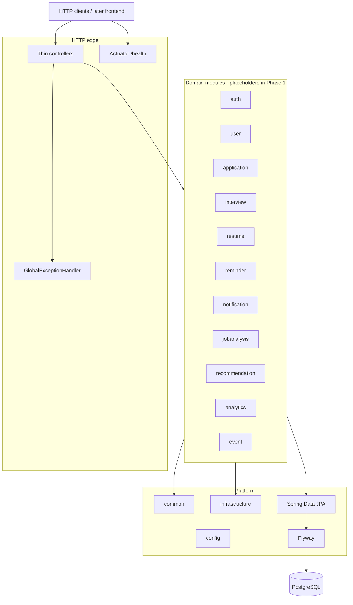

# JobPilot

Creating a dev branch to push initial changes here.

Backend-first intelligent job application tracker. This repository is the primary portfolio deliverable: a **modular monolith** on Spring Boot. A frontend will come much later.

**This commit set is Phase 1 — Backend Foundation only.** Auth, application CRUD, messaging, caches, reminders, analytics, and a UI are explicitly out of scope.

## Architecture

JobPilot is organized as a single deployable Spring Boot application with package-level module boundaries. Later phases add behavior inside these packages; they do not introduce a microservice split.



Package root: `com.jobpilot`. Controllers stay thin; there is no domain logic yet.

## Tech stack (Phase 1)

| Piece | Choice |
| --- | --- |
| Language | Java 21 |
| Framework | Spring Boot 3.5 |
| Build | Gradle (Kotlin DSL) |
| Persistence | Spring Data JPA + Flyway |
| Database | PostgreSQL 16 |
| Ops | Spring Boot Actuator (`/actuator/health`) |
| Packaging | Dockerfile + Docker Compose |

Hibernate `ddl-auto` is **`none`** on the main profile. Schema changes go through Flyway.

## Prerequisites

- JDK 21
- Docker (for PostgreSQL, and optionally the app image)

## Environment variables

Copy [`.env.example`](.env.example) to `.env` and adjust. Nothing secret is committed.

| Variable | Purpose | Default |
| --- | --- | --- |
| `SERVER_PORT` | HTTP port | `8080` |
| `SPRING_PROFILES_ACTIVE` | Spring profile | `local` (compose / example) |
| `SPRING_DATASOURCE_URL` | JDBC URL | `jdbc:postgresql://localhost:5432/jobpilot` |
| `SPRING_DATASOURCE_USERNAME` | DB user | `jobpilot` |
| `SPRING_DATASOURCE_PASSWORD` | DB password | `changeme` |
| `POSTGRES_DB` / `POSTGRES_USER` / `POSTGRES_PASSWORD` / `POSTGRES_PORT` | Compose Postgres service | `jobpilot` / `jobpilot` / `changeme` / `5432` |

## Local run

### 1. PostgreSQL via Docker Compose

```bash
docker compose up -d postgres
```

This publishes Postgres on `localhost:5432` with the defaults above.

### 2. Application via Gradle

```bash
./gradlew bootRun
```

Or with the local profile (more verbose SQL logging):

```bash
./gradlew bootRun --args='--spring.profiles.active=local'
```

Useful URLs:

- `GET /api/v1/ping` — trivial ping
- `GET /actuator/health` — Actuator health
- Errors use a fixed JSON shape: `timestamp`, `status`, `error`, `message`, `path`

### 3. Optional: app container as well

```bash
docker compose --profile app up --build
```

The app container talks to the `postgres` service on the compose network.

## Tests and build

Tests use an in-memory H2 database (PostgreSQL compatibility mode) so they do not require Docker.

```bash
./gradlew test
./gradlew build
```

## Planned later phases (not implemented)

Phases 2–13 are planned and **not** present here. Expected later work includes authentication, application and interview tracking, resumes, reminders, notifications, job analysis, recommendations, analytics, and a frontend. Do not treat placeholder packages as working features.

## License

No license has been chosen yet.
