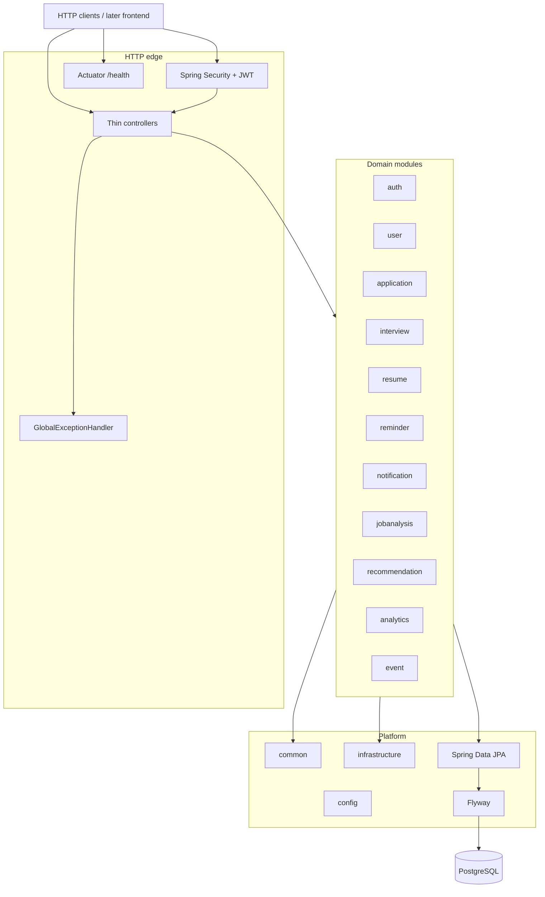

# JobPilot

Backend-first intelligent job application tracker. This repository is the primary portfolio deliverable: a **modular monolith** on Spring Boot. A frontend will come much later.

**Current scope: Phase 1 foundation + Phase 2 JWT authentication.** Application CRUD, messaging, caches, reminders, analytics, and a UI remain out of scope.

## Architecture

JobPilot is organized as a single deployable Spring Boot application with package-level module boundaries. Later phases add behavior inside these packages; they do not introduce a microservice split.



Package root: `com.jobpilot`. Controllers stay thin; business logic lives in services. JPA entities are not exposed in API responses — use DTOs.

## Tech stack

| Piece | Choice |
| --- | --- |
| Language | Java 21 |
| Framework | Spring Boot 3.5 |
| Build | Gradle (Kotlin DSL) |
| Persistence | Spring Data JPA + Flyway |
| Database | PostgreSQL 16 (H2 for tests) |
| Security | Spring Security + JWT (jjwt) + BCrypt |
| Ops | Spring Boot Actuator (`/actuator/health`) |
| Packaging | Dockerfile + Docker Compose |

Hibernate `ddl-auto` is **`none`** on the main profile. Schema changes go through Flyway (`V1__init.sql`, `V2__auth_users.sql`).

## Prerequisites

- JDK 21
- Docker (for PostgreSQL, and optionally the app image)

## Environment variables

Copy [`.env.example`](.env.example) to `.env` and adjust. Nothing secret is committed.

| Variable | Purpose | Default |
| --- | --- | --- |
| `SERVER_PORT` | HTTP port | `8080` |
| `SPRING_PROFILES_ACTIVE` | Spring profile | `local` (compose / example) |
| `SPRING_DATASOURCE_URL` | JDBC URL | `jdbc:postgresql://localhost:5432/jobpilot` |
| `SPRING_DATASOURCE_USERNAME` | DB user | `jobpilot` |
| `SPRING_DATASOURCE_PASSWORD` | DB password | `changeme` |
| `POSTGRES_DB` / `POSTGRES_USER` / `POSTGRES_PASSWORD` / `POSTGRES_PORT` | Compose Postgres service | `jobpilot` / `jobpilot` / `changeme` / `5432` |
| `JOBPILOT_JWT_SECRET` | HMAC secret for access tokens | **local/test default only — override in production** |
| `JOBPILOT_JWT_EXPIRATION_MS` | Access token lifetime (ms) | `86400000` (24h) |

> **Production:** you **must** set `JOBPILOT_JWT_SECRET` to a long random value (e.g. `openssl rand -base64 48`). The YAML default is for local development and tests only.

## Local run

### 1. PostgreSQL via Docker Compose

```bash
docker compose up -d postgres
```

This publishes Postgres on `localhost:5432` with the defaults above.

### 2. Application via Gradle

```bash
./gradlew bootRun
```

Or with the local profile (more verbose SQL logging):

```bash
./gradlew bootRun --args='--spring.profiles.active=local'
```

Useful URLs:

- `GET /api/v1/ping` — trivial ping (public)
- `GET /actuator/health` — Actuator health (public)
- `POST /api/auth/register` / `POST /api/auth/login` — auth (public)
- `GET /api/users/me` — current user (requires `Authorization: Bearer <token>`)
- Errors use a fixed JSON shape: `timestamp`, `status`, `error`, `message`, `path`

### 3. Optional: app container as well

```bash
docker compose --profile app up --build
```

The app container talks to the `postgres` service on the compose network. Pass `JOBPILOT_JWT_SECRET` via the environment when using this path.

## Phase 2 — JWT authentication

### Endpoints

| Method | Path | Auth | Notes |
| --- | --- | --- | --- |
| `POST` | `/api/auth/register` | Public | Body: `email`, `password` (min 8), optional `name`. Returns JWT + user. Duplicate email → **409**. |
| `POST` | `/api/auth/login` | Public | Body: `email`, `password`. Returns JWT + user. Bad credentials → **401**. |
| `GET` | `/api/users/me` | Bearer JWT | Current user from `SecurityContext` (never trust a client-supplied user id). Missing/invalid token → **401**. |

Passwords are stored as BCrypt hashes. Access tokens are HS256 JWTs (jjwt). Refresh tokens are out of scope for v1.

### curl examples

```bash
# Register
curl -sS -X POST http://localhost:8080/api/auth/register \
  -H 'Content-Type: application/json' \
  -d '{"email":"you@example.com","password":"password123","name":"You"}'

# Login
TOKEN=$(curl -sS -X POST http://localhost:8080/api/auth/login \
  -H 'Content-Type: application/json' \
  -d '{"email":"you@example.com","password":"password123"}' \
  | python3 -c "import sys,json; print(json.load(sys.stdin)['accessToken'])")

# Current user
curl -sS http://localhost:8080/api/users/me \
  -H "Authorization: Bearer $TOKEN"
```

## Tests and build

Tests use an in-memory H2 database (PostgreSQL compatibility mode) so they do not require Docker.

```bash
./gradlew test
./gradlew build
```

## Planned later phases (not implemented)

Phases 3–13 are planned and **not** present here. Expected later work includes application and interview tracking, resumes, reminders, notifications, job analysis, recommendations, analytics, and a frontend. Do not treat placeholder packages as working features.

## License

No license has been chosen yet.
